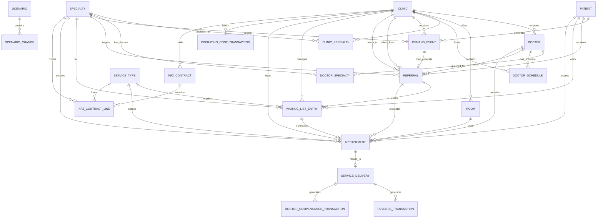

# 06 — Entity Relationship Diagram (ERD)

**Version:** 1.0
**Status:** Draft — Ready for Review
**Last Updated:** 2026-07-22

---

# 1. Purpose

This document defines the logical Entity Relationship Diagram (ERD) for the **Healthcare Operations BI Simulator**.

The ERD translates the business logic and process flows defined in:

* `01_Project_Overview.md`
* `02_Business_Model.md`
* `03_Business_Rules.md`
* `04_Entity_Dictionary.md`
* `05_Process_Flows.md`

into a structured relational data model.

The ERD defines:

* entities,
* primary keys,
* foreign keys,
* cardinality,
* temporal relationships,
* transactional relationships,
* derived analytical concepts.

The ERD is the architectural bridge between:

```text
Business Logic
       ↓
Process Flows
       ↓
Logical Data Model
       ↓
Python Data Generator
       ↓
SQL Data Layer
       ↓
BI / Tableau Layer
```

This document defines the **logical model**.

It does not define:

* SQL syntax,
* database-specific data types,
* Python implementation,
* physical indexing strategy,
* Tableau dashboard design.

Those topics are addressed in later project stages.

---

# 2. ERD Design Principles

The model follows the following principles.

## 2.1 Master Data vs Transactional Data

The model separates:

### Master / Reference Data

```text
CLINIC
SPECIALTY
SERVICE_TYPE
DOCTOR
ROOM
PATIENT
```

### Operational Data

```text
DOCTOR_SCHEDULE
DEMAND_EVENT
REFERRAL
WAITING_LIST_ENTRY
APPOINTMENT
SERVICE_DELIVERY
```

### Financial Data

```text
REVENUE_TRANSACTION
DOCTOR_COMPENSATION_TRANSACTION
OPERATING_COST_TRANSACTION
```

### Contract / Capacity Data

```text
NFZ_CONTRACT
NFZ_CONTRACT_LINE
```

### Management / Scenario Data

```text
RESOURCE_REALLOCATION
SCENARIO
SCENARIO_CHANGE
```

---

## 2.2 Time-Aware Modeling

The simulator is time-dependent.

Historical records must not be overwritten when future changes occur.

The following entities are therefore explicitly time-aware:

```text
DOCTOR_SCHEDULE
NFZ_CONTRACT
NFZ_CONTRACT_LINE
RESOURCE_REALLOCATION
SCENARIO_CHANGE
```

Where applicable, records use:

```text
effective_from
effective_to
```

or equivalent period boundaries.

---

## 2.3 Derived Metrics Are Not Primary Entities

The following concepts are treated as derived metrics rather than independent master entities:

```text
OPERATIONAL_CAPACITY
NFZ_FUNDED_CAPACITY
EFFECTIVE_CAPACITY
WAITING_TIME
CAPACITY_UTILIZATION
CONTRACT_UTILIZATION
INTERNAL_CAPTURE_RATE
REFERRAL_LEAKAGE_RATE
NET_CLINIC_RESULT
```

These values are calculated from source entities and transactions.

They may later be materialized in analytical tables or views, but they are not authoritative transactional entities in the core logical model.

---

# 3. High-Level ERD

The complete logical structure is:

```text
                         ┌──────────────┐
                         │    CLINIC    │
                         └──────┬───────┘
                                │
              ┌─────────────────┼─────────────────┐
              │                 │                 │
              ↓                 ↓                 ↓
        CLINIC_SPECIALTY      DOCTOR             ROOM
              │                 │                 │
              ↓                 ↓                 │
         SPECIALTY       DOCTOR_SCHEDULE          │
              │                 │                 │
              │                 └────────┬────────┘
              │                          │
              │                          ↓
              │                     APPOINTMENT
              │                          │
              ↓                          ↓
        SERVICE_TYPE              SERVICE_DELIVERY
              │                          │
              │                 ┌────────┼────────┐
              │                 ↓        ↓        ↓
              │             REVENUE   COMPENSATION
              │               │          │
              │               └────┬─────┘
              │                    ↓
              │              FINANCIAL RESULTS
              │
              ↓
        NFZ_CONTRACT
              │
              ↓
      NFZ_CONTRACT_LINE
              │
              ↓
      NFZ FUNDED CAPACITY
```

Patient and referral flow:

```text
PATIENT
   │
   ↓
DEMAND_EVENT
   │
   ↓
REFERRAL
   │
   ↓
WAITING_LIST_ENTRY
   │
   ↓
APPOINTMENT
   │
   ↓
SERVICE_DELIVERY
```

Management flow:

```text
RESOURCE_REALLOCATION
        ↓
Future Resource Availability
        ↓
Operational Capacity
        ↓
Effective Capacity
        ↓
Waiting Time
        ↓
Patient Outcomes
```

---

# 4. Core Entity Domains

The ERD is divided into six logical domains.

```text
1. Organization
2. Workforce & Capacity
3. Patient & Demand
4. Operations
5. Finance
6. Contracts & Management
```

---

# 5. Domain 1 — Organization

---

# 5.1 CLINIC

## Purpose

Represents a healthcare facility or operational clinic unit.

## Primary Key

```text
clinic_id
```

## Key Attributes

```text
clinic_id
clinic_name
clinic_type
location
status
```

## Relationships

```text
CLINIC
    1
    │
    ├──── N DOCTOR
    │
    ├──── N ROOM
    │
    ├──── N CLINIC_SPECIALTY
    │
    ├──── N DEMAND_EVENT
    │
    ├──── N NFZ_CONTRACT
    │
    └──── N OPERATING_COST_TRANSACTION
```

---

# 5.2 SPECIALTY

## Purpose

Represents a medical specialty.

Examples may include:

```text
Cardiology
Dermatology
Pediatrics
Orthopedics
```

## Primary Key

```text
specialty_id
```

## Key Attributes

```text
specialty_id
specialty_name
status
```

## Relationships

```text
SPECIALTY
    1
    │
    ├──── N CLINIC_SPECIALTY
    │
    ├──── N DOCTOR_SPECIALTY
    │
    ├──── N REFERRAL
    │
    └──── N NFZ_CONTRACT_LINE
```

---

# 5.3 CLINIC_SPECIALTY

## Purpose

Defines which specialties are available at a clinic.

This entity is required to determine whether a referral can be captured internally.

## Primary Key

```text
clinic_specialty_id
```

## Foreign Keys

```text
clinic_id
specialty_id
```

## Key Attributes

```text
clinic_specialty_id
clinic_id
specialty_id
effective_from
effective_to
status
```

## Relationship

```text
CLINIC
  1
  │
  N
CLINIC_SPECIALTY
  N
  │
  1
SPECIALTY
```

## Business Rule

If no active `CLINIC_SPECIALTY` record exists for the target specialty:

```text
Internal Specialty Available = FALSE
```

The referral is routed externally.

---

# 6. Domain 2 — Workforce & Capacity

---

# 6.1 DOCTOR

## Purpose

Represents a healthcare professional who may deliver services.

## Primary Key

```text
doctor_id
```

## Key Attributes

```text
doctor_id
doctor_name
employment_type
compensation_model
status
```

## Relationships

```text
DOCTOR
    1
    │
    ├──── N DOCTOR_SPECIALTY
    │
    ├──── N DOCTOR_SCHEDULE
    │
    ├──── N APPOINTMENT
    │
    └──── N DOCTOR_COMPENSATION_TRANSACTION
```

---

# 6.2 DOCTOR_SPECIALTY

## Purpose

Defines the specialties a doctor is qualified to provide.

## Primary Key

```text
doctor_specialty_id
```

## Foreign Keys

```text
doctor_id
specialty_id
```

## Key Attributes

```text
doctor_specialty_id
doctor_id
specialty_id
effective_from
effective_to
status
```

## Relationship

```text
DOCTOR
  1
  │
  N
DOCTOR_SPECIALTY
  N
  │
  1
SPECIALTY
```

A doctor may have multiple specialties.

A specialty may be provided by multiple doctors.

---

# 6.3 DOCTOR_SCHEDULE

## Purpose

Defines when a doctor is operationally available.

This entity represents planned availability rather than actual appointments.

## Primary Key

```text
doctor_schedule_id
```

## Foreign Keys

```text
doctor_id
clinic_id
```

## Key Attributes

```text
doctor_schedule_id
doctor_id
clinic_id
schedule_date
start_time
end_time
effective_from
effective_to
status
```

## Relationships

```text
DOCTOR
  1
  │
  N
DOCTOR_SCHEDULE
  N
  │
  1
CLINIC
```

## Business Role

`DOCTOR_SCHEDULE` is a primary source of operational capacity.

It determines:

```text
Available Doctor Time
```

which contributes to:

```text
Operational Capacity
```

---

# 6.4 ROOM

## Purpose

Represents a physical room that can be used to deliver healthcare services.

## Primary Key

```text
room_id
```

## Foreign Keys

```text
clinic_id
```

## Key Attributes

```text
room_id
clinic_id
room_name
room_type
status
```

## Relationship

```text
CLINIC
  1
  │
  N
ROOM
```

A room belongs to one clinic.

A clinic may have multiple rooms.

---

# 6.5 APPOINTMENT

## Purpose

Represents a scheduled patient visit.

An appointment reserves:

* doctor time,
* room time,
* service capacity.

## Primary Key

```text
appointment_id
```

## Foreign Keys

```text
patient_id
clinic_id
doctor_id
room_id
specialty_id
service_type_id
referral_id
waiting_list_entry_id
```

## Key Attributes

```text
appointment_id
patient_id
clinic_id
doctor_id
room_id
specialty_id
service_type_id
referral_id
waiting_list_entry_id
appointment_date
start_time
end_time
status
```

## Relationships

```text
PATIENT
  1
  │
  N
APPOINTMENT

DOCTOR
  1
  │
  N
APPOINTMENT

ROOM
  1
  │
  N
APPOINTMENT

SERVICE_TYPE
  1
  │
  N
APPOINTMENT

REFERRAL
  1
  │
  0..N
APPOINTMENT
```

## Business Rules

The following constraints apply:

```text
Same Doctor
+
Overlapping Appointment
=
INVALID
```

```text
Same Room
+
Overlapping Appointment
=
INVALID
```

An appointment must fit within:

```text
DOCTOR_SCHEDULE
```

and must use an eligible:

```text
ROOM
```

---

# 7. Domain 3 — Patient & Demand

---

# 7.1 PATIENT

## Purpose

Represents a patient participating in the simulated healthcare system.

## Primary Key

```text
patient_id
```

## Key Attributes

```text
patient_id
date_of_birth
gender
registration_date
status
```

## Relationships

```text
PATIENT
    1
    │
    ├──── N DEMAND_EVENT
    │
    ├──── N REFERRAL
    │
    ├──── N WAITING_LIST_ENTRY
    │
    └──── N APPOINTMENT
```

---

# 7.2 DEMAND_EVENT

## Purpose

Represents a healthcare demand event entering the system.

Demand does not automatically create a referral.

## Primary Key

```text
demand_event_id
```

## Foreign Keys

```text
patient_id
clinic_id
specialty_id
```

## Key Attributes

```text
demand_event_id
patient_id
clinic_id
specialty_id
demand_source
demand_date
care_pathway
status
```

## Relationship

```text
PATIENT
  1
  │
  N
DEMAND_EVENT
```

A demand event may generate zero or one referral.

```text
DEMAND_EVENT
    1
    │
    0..1
REFERRAL
```

---

# 7.3 REFERRAL

## Purpose

Represents a formal referral from a referring provider to a target specialty.

## Primary Key

```text
referral_id
```

## Foreign Keys

```text
patient_id
demand_event_id
referring_doctor_id
referring_clinic_id
target_clinic_id
target_specialty_id
```

## Key Attributes

```text
referral_id
patient_id
demand_event_id
referring_doctor_id
referring_clinic_id
target_clinic_id
target_specialty_id
referral_date
patient_decision
referral_outcome
outcome_date
```

## Patient Decision

The patient decision is:

```text
WAIT
EXTERNAL
DROP
```

## Referral Outcome

The referral outcome is:

```text
INTERNAL
EXTERNAL
NOT_COMPLETED
```

These are intentionally separate concepts.

### Example

```text
Patient Decision = WAIT
        ↓
Appointment
        ↓
Service Delivery
        ↓
Referral Outcome = INTERNAL
```

Another example:

```text
Patient Decision = DROP
        ↓
Referral Outcome = NOT_COMPLETED
```

---

# 8. Domain 4 — Operations

---

# 8.1 WAITING_LIST_ENTRY

## Purpose

Represents the lifecycle of a patient waiting for internal care.

The model treats the waiting list as a lifecycle record rather than a daily snapshot.

## Primary Key

```text
waiting_list_entry_id
```

## Foreign Keys

```text
referral_id
patient_id
clinic_id
specialty_id
service_type_id
appointment_id
```

## Key Attributes

```text
waiting_list_entry_id
referral_id
patient_id
clinic_id
specialty_id
service_type_id
created_at
scheduled_at
completed_at
removed_at
removal_reason
status
```

## Lifecycle

```text
WAIT
   ↓
WAITING_LIST_ENTRY
   ↓
APPOINTMENT
   ↓
SERVICE_DELIVERY
```

Possible removal reasons include:

```text
SCHEDULED
COMPLETED
EXTERNAL
DROPPED
CANCELLED
```

## Derived Waiting Time

Waiting time may be calculated as:

```text
Waiting Time
=
Appointment Date
-
Waiting List Entry Date
```

For unresolved entries:

```text
Current Waiting Time
=
Current Date
-
Waiting List Entry Date
```

---

# 8.2 SERVICE_TYPE

## Purpose

Defines the type of healthcare service delivered.

Examples:

```text
FIRST_VISIT
FOLLOW_UP
DIAGNOSTIC
OTHER
```

## Primary Key

```text
service_type_id
```

## Key Attributes

```text
service_type_id
service_type_name
standard_duration
revenue_rule
compensation_rule
status
```

## Relationship

```text
SERVICE_TYPE
    1
    │
    ├──── N APPOINTMENT
    │
    ├──── N SERVICE_DELIVERY
    │
    └──── N NFZ_CONTRACT_LINE
```

Service type may affect:

* appointment duration,
* operational capacity,
* NFZ-funded capacity,
* revenue,
* doctor compensation.

---

# 8.3 SERVICE_DELIVERY

## Purpose

Represents a completed or attempted delivery of a healthcare service.

## Primary Key

```text
service_delivery_id
```

## Foreign Keys

```text
appointment_id
patient_id
clinic_id
doctor_id
specialty_id
service_type_id
```

## Key Attributes

```text
service_delivery_id
appointment_id
patient_id
clinic_id
doctor_id
specialty_id
service_type_id
delivery_date
delivery_status
payer_type
```

## Relationship

```text
APPOINTMENT
    1
    │
    0..1
SERVICE_DELIVERY
```

A completed service may generate:

```text
REVENUE_TRANSACTION
```

and:

```text
DOCTOR_COMPENSATION_TRANSACTION
```

---

# 9. Domain 5 — Finance

---

# 9.1 REVENUE_TRANSACTION

## Purpose

Represents revenue generated by delivered healthcare services.

## Primary Key

```text
revenue_transaction_id
```

## Foreign Keys

```text
service_delivery_id
clinic_id
service_type_id
```

## Key Attributes

```text
revenue_transaction_id
service_delivery_id
clinic_id
service_type_id
transaction_date
payer_type
amount
```

## Relationship

```text
SERVICE_DELIVERY
    1
    │
    0..N
REVENUE_TRANSACTION
```

Revenue is generated from completed service delivery according to applicable pricing or payer rules.

---

# 9.2 DOCTOR_COMPENSATION_TRANSACTION

## Purpose

Represents compensation paid or accrued to a doctor for healthcare services.

## Primary Key

```text
doctor_compensation_transaction_id
```

## Foreign Keys

```text
doctor_id
service_delivery_id
clinic_id
```

## Key Attributes

```text
doctor_compensation_transaction_id
doctor_id
service_delivery_id
clinic_id
compensation_model
transaction_date
amount
```

## Compensation Models

```text
PERCENTAGE
HOURLY
MIXED
```

## Relationship

```text
SERVICE_DELIVERY
    1
    │
    0..N
DOCTOR_COMPENSATION_TRANSACTION
```

---

# 9.3 OPERATING_COST_TRANSACTION

## Purpose

Represents operating costs incurred by a clinic.

## Primary Key

```text
operating_cost_transaction_id
```

## Foreign Keys

```text
clinic_id
```

## Key Attributes

```text
operating_cost_transaction_id
clinic_id
cost_date
cost_type
cost_behavior
amount
cost_driver
```

## Cost Behavior

```text
FIXED
VARIABLE
SEMI_VARIABLE
```

## Cost Driver

The `cost_driver` identifies the basis for the cost.

Examples:

```text
RENT
UTILITIES
STAFF
SERVICE_VOLUME
ROOM_USAGE
OTHER
```

The exact taxonomy may be expanded during generator implementation.

---

# 10. Domain 6 — NFZ Contracts & Capacity

---

# 10.1 NFZ_CONTRACT

## Purpose

Represents an NFZ-funded contract applicable to a clinic and contract period.

## Primary Key

```text
nfz_contract_id
```

## Foreign Keys

```text
clinic_id
```

## Key Attributes

```text
nfz_contract_id
clinic_id
contract_number
contract_start_date
contract_end_date
status
```

## Relationship

```text
CLINIC
  1
  │
  N
NFZ_CONTRACT
```

---

# 10.2 NFZ_CONTRACT_LINE

## Purpose

Defines the funded service volume under a specific NFZ contract.

The contract line is the required level of granularity for funded capacity.

## Primary Key

```text
nfz_contract_line_id
```

## Foreign Keys

```text
nfz_contract_id
specialty_id
service_type_id
```

## Key Attributes

```text
nfz_contract_line_id
nfz_contract_id
specialty_id
service_type_id
contracted_volume
effective_from
effective_to
```

## Relationship

```text
NFZ_CONTRACT
    1
    │
    N
NFZ_CONTRACT_LINE

SPECIALTY
    1
    │
    N
NFZ_CONTRACT_LINE

SERVICE_TYPE
    1
    │
    N
NFZ_CONTRACT_LINE
```

## Business Role

This entity is the primary source for:

```text
NFZ Funded Capacity
```

at the logical grain:

```text
Clinic
+
Specialty
+
Service Type
+
Contract Period
```

---

# 11. Capacity Model

Capacity is not stored as one independent master entity.

Instead, it is derived from operational and contractual sources.

---

## 11.1 Operational Capacity

Operational capacity is derived from:

```text
DOCTOR
+
DOCTOR_SPECIALTY
+
DOCTOR_SCHEDULE
+
ROOM
+
SERVICE_TYPE
+
APPOINTMENT
```

Conceptually:

```text
Doctor Available Time
+
Room Available Time
+
Service Duration
+
Existing Appointments
        ↓
Operational Capacity
```

---

## 11.2 NFZ Funded Capacity

NFZ-funded capacity is derived from:

```text
NFZ_CONTRACT
+
NFZ_CONTRACT_LINE
-
Previously Delivered Funded Services
```

Conceptually:

```text
Contracted Volume
-
Funded Delivered Services
=
Remaining NFZ Funded Capacity
```

---

## 11.3 Effective Capacity

The authoritative business rule is:

```text
Effective Capacity
=
MIN(
    Operational Capacity,
    NFZ Funded Capacity
)
```

The logical analytical grain is:

```text
CLINIC
+
SPECIALTY
+
SERVICE_TYPE
+
TIME_PERIOD
```

---

# 12. Capacity Grain

Capacity calculations must not be stored or aggregated only at clinic level.

The minimum analytical grain is:

```text
Clinic
+
Specialty
+
Service Type
+
Time Period
```

Example:

```text
Clinic A
Cardiology
FIRST_VISIT
Q3 2026
```

is analytically distinct from:

```text
Clinic A
Cardiology
FOLLOW_UP
Q3 2026
```

This distinction is required because:

* service duration may differ,
* NFZ funding may differ,
* revenue may differ,
* compensation may differ.

---

# 13. Capacity Calculation Flow

The complete capacity flow is:

```text
DOCTOR
    ↓
DOCTOR_SPECIALTY
    ↓
DOCTOR_SCHEDULE
    ↓
AVAILABLE DOCTOR TIME
    ↓
ROOM AVAILABILITY
    ↓
SERVICE_TYPE DURATION
    ↓
EXISTING APPOINTMENTS
    ↓
OPERATIONAL CAPACITY
```

Separately:

```text
NFZ_CONTRACT
    ↓
NFZ_CONTRACT_LINE
    ↓
CONTRACTED VOLUME
    ↓
DELIVERED FUNDED SERVICES
    ↓
NFZ FUNDED CAPACITY
```

Then:

```text
OPERATIONAL CAPACITY
          +
NFZ FUNDED CAPACITY
          ↓
         MIN
          ↓
EFFECTIVE CAPACITY
```

---

# 14. Referral Flow in the ERD

The referral lifecycle is:

```text
PATIENT
    ↓
DEMAND_EVENT
    ↓
REFERRAL
    ↓
PATIENT_DECISION
```

If:

```text
WAIT
```

then:

```text
WAITING_LIST_ENTRY
    ↓
APPOINTMENT
    ↓
SERVICE_DELIVERY
    ↓
REFERRAL_OUTCOME = INTERNAL
```

If:

```text
EXTERNAL
```

then:

```text
REFERRAL_OUTCOME = EXTERNAL
```

If:

```text
DROP
```

then:

```text
REFERRAL_OUTCOME = NOT_COMPLETED
```

The distinction is:

```text
PATIENT_DECISION
        ≠
REFERRAL_OUTCOME
```

---

# 15. Appointment and Resource Integrity

An appointment is the point at which operational resources are reserved.

The appointment references:

```text
DOCTOR
ROOM
SERVICE_TYPE
SPECIALTY
```

Therefore:

```text
APPOINTMENT
    ↓
Doctor Time
    +
Room Time
    +
Service Capacity
```

The model must enforce:

```text
Doctor cannot have overlapping appointments.
```

```text
Room cannot have overlapping appointments.
```

```text
Appointment must fit within Doctor Schedule.
```

```text
Doctor must be qualified for Specialty.
```

```text
Service Type must be compatible with Specialty.
```

---

# 16. Temporal Model

The simulator must preserve historical state.

---

## 16.1 Doctor Schedule

```text
DOCTOR_SCHEDULE
    effective_from
    effective_to
```

Changes in future availability must not overwrite historical schedules.

---

## 16.2 NFZ Contract

```text
NFZ_CONTRACT
    contract_start_date
    contract_end_date
```

Contract amendments apply from their effective date.

---

## 16.3 NFZ Contract Line

```text
NFZ_CONTRACT_LINE
    effective_from
    effective_to
```

Funded capacity changes apply only to the relevant period.

---

## 16.4 Resource Reallocation

Resource changes must preserve historical state.

Example:

```text
Doctor A
Clinic X
100 hours
2026-01-01 → 2026-06-30
```

Then:

```text
Resource Reallocation
Effective Date = 2026-07-01
```

Future state:

```text
Doctor A
Clinic X
60 hours
2026-07-01 → 2026-12-31
```

Historical capacity remains unchanged.

---

# 17. Resource Reallocation

## 17.1 RESOURCE_REALLOCATION

### Purpose

Represents a management decision that changes resource allocation.

### Primary Key

```text
resource_reallocation_id
```

### Key Attributes

```text
resource_reallocation_id
effective_date
resource_type
source_clinic_id
target_clinic_id
resource_quantity
status
```

### Resource Types

```text
DOCTOR
DOCTOR_HOURS
ROOM
CAPACITY
```

### Conceptual Flow

```text
CURRENT STATE
       ↓
RESOURCE_REALLOCATION
       ↓
EFFECTIVE DATE
       ↓
FUTURE RESOURCE STATE
       ↓
OPERATIONAL CAPACITY
```

Historical data must not be modified retroactively.

---

# 18. Scenario Model

---

# 18.1 SCENARIO

## Purpose

Represents a hypothetical management scenario.

## Primary Key

```text
scenario_id
```

## Key Attributes

```text
scenario_id
scenario_name
scenario_type
created_at
status
```

---

# 18.2 SCENARIO_CHANGE

## Purpose

Represents a specific change applied within a scenario.

## Primary Key

```text
scenario_change_id
```

## Foreign Keys

```text
scenario_id
```

## Key Attributes

```text
scenario_change_id
scenario_id
change_type
effective_date
target_entity
target_entity_id
change_value
```

## Relationship

```text
SCENARIO
    1
    │
    N
SCENARIO_CHANGE
```

---

# 19. Scenario Flow

```text
BASELINE STATE
       ↓
SCENARIO
       ↓
SCENARIO_CHANGE
       ↓
Apply Future Changes
       ↓
Recalculate Capacity
       ↓
Recalculate Waiting Time
       ↓
Recalculate Patient Outcomes
       ↓
Recalculate Service Delivery
       ↓
Recalculate Financial Results
       ↓
Compare:
BASELINE
    VS
SCENARIO
```

Historical baseline data remains unchanged.

---

# 20. Financial Flow

The financial relationship is:

```text
SERVICE_DELIVERY
       ↓
REVENUE_TRANSACTION
       ↓
Doctor Compensation
       ↓
Clinic Revenue
       ↓
OPERATING_COST_TRANSACTION
       ↓
NET CLINIC RESULT
```

Conceptually:

```text
Service Revenue
-
Doctor Compensation
=
Clinic Revenue
```

Then:

```text
Clinic Revenue
-
Operating Costs
=
Net Clinic Result
```

Or equivalently:

```text
Service Revenue
-
Doctor Compensation
-
Operating Costs
=
Net Clinic Result
```

---

# 21. Revenue Relationship

The logical relationship is:

```text
SERVICE_DELIVERY
       1
       │
       N
REVENUE_TRANSACTION
```

Revenue may be generated according to:

```text
SERVICE_TYPE
+
PAYER_TYPE
+
PRICING RULE
```

---

# 22. Doctor Compensation Relationship

The logical relationship is:

```text
SERVICE_DELIVERY
       1
       │
       N
DOCTOR_COMPENSATION_TRANSACTION
```

Compensation may use:

```text
PERCENTAGE
HOURLY
MIXED
```

The exact formula is defined by compensation configuration.

---

# 23. Operating Cost Relationship

Operating costs are linked to the clinic and reporting period.

```text
CLINIC
  1
  │
  N
OPERATING_COST_TRANSACTION
```

Cost behavior:

```text
FIXED
VARIABLE
SEMI_VARIABLE
```

The model preserves cost behavior to enable scenario analysis.

---

# 24. Core Cardinality Map

The primary relationships are:

```text
CLINIC
  1 ─── N DOCTOR

CLINIC
  1 ─── N ROOM

CLINIC
  1 ─── N CLINIC_SPECIALTY

SPECIALTY
  1 ─── N CLINIC_SPECIALTY

DOCTOR
  1 ─── N DOCTOR_SPECIALTY

SPECIALTY
  1 ─── N DOCTOR_SPECIALTY

DOCTOR
  1 ─── N DOCTOR_SCHEDULE

CLINIC
  1 ─── N DOCTOR_SCHEDULE

PATIENT
  1 ─── N DEMAND_EVENT

DEMAND_EVENT
  1 ─── 0..1 REFERRAL

PATIENT
  1 ─── N REFERRAL

REFERRAL
  1 ─── 0..N WAITING_LIST_ENTRY

WAITING_LIST_ENTRY
  1 ─── 0..1 APPOINTMENT

DOCTOR
  1 ─── N APPOINTMENT

ROOM
  1 ─── N APPOINTMENT

SERVICE_TYPE
  1 ─── N APPOINTMENT

APPOINTMENT
  1 ─── 0..1 SERVICE_DELIVERY

SERVICE_DELIVERY
  1 ─── 0..N REVENUE_TRANSACTION

SERVICE_DELIVERY
  1 ─── 0..N DOCTOR_COMPENSATION_TRANSACTION

CLINIC
  1 ─── N OPERATING_COST_TRANSACTION

CLINIC
  1 ─── N NFZ_CONTRACT

NFZ_CONTRACT
  1 ─── N NFZ_CONTRACT_LINE

SPECIALTY
  1 ─── N NFZ_CONTRACT_LINE

SERVICE_TYPE
  1 ─── N NFZ_CONTRACT_LINE

SCENARIO
  1 ─── N SCENARIO_CHANGE
```

---

# 25. Mermaid ERD

The following Mermaid diagram represents the logical core of the ERD.



---

# 26. End-to-End Data Lineage

The complete operational lineage is:

```text
PATIENT
    ↓
DEMAND_EVENT
    ↓
REFERRAL
    ↓
PATIENT_DECISION
    ↓
WAITING_LIST_ENTRY
    ↓
APPOINTMENT
    ↓
SERVICE_DELIVERY
    ↓
REVENUE_TRANSACTION
    ↓
DOCTOR_COMPENSATION_TRANSACTION
    ↓
OPERATING_COST_TRANSACTION
    ↓
NET CLINIC RESULT
```

Capacity lineage:

```text
DOCTOR
    +
DOCTOR_SPECIALTY
    +
DOCTOR_SCHEDULE
    +
ROOM
    +
SERVICE_TYPE
    +
APPOINTMENT
    ↓
OPERATIONAL CAPACITY
```

Contract lineage:

```text
NFZ_CONTRACT
    +
NFZ_CONTRACT_LINE
    +
FUNDED SERVICE DELIVERY
    ↓
NFZ FUNDED CAPACITY
```

Final capacity:

```text
OPERATIONAL CAPACITY
        +
NFZ FUNDED CAPACITY
        ↓
       MIN
        ↓
EFFECTIVE CAPACITY
```

Management lineage:

```text
Operational Data
       ↓
KPI Analysis
       ↓
Management Decision
       ↓
RESOURCE_REALLOCATION
       OR
NFZ Contract Amendment
       OR
SCENARIO
       ↓
Future State
```

---

# 27. Analytical Layer

The following metrics should be derived from the ERD rather than stored as independent source-of-truth entities.

## Capacity

```text
Operational Capacity
NFZ Funded Capacity
Effective Capacity
```

## Waiting

```text
Waiting Time
Waiting List Size
```

## Referral

```text
Internal Capture Rate
Referral Leakage Rate
```

## Operations

```text
Doctor Utilization
Room Utilization
Capacity Utilization
```

## Finance

```text
Total Revenue
Doctor Compensation
Operating Costs
Net Clinic Result
```

## NFZ

```text
Contract Utilization
Remaining Funded Capacity
Underperformance
Overperformance
```

---

# 28. ERD Integrity Rules

The following integrity rules must be enforced by the logical model.

## Rule 1 — Doctor Qualification

A doctor may only deliver a specialty for which an active `DOCTOR_SPECIALTY` record exists.

---

## Rule 2 — Clinic Specialty

A clinic may only internally capture a specialty if an active `CLINIC_SPECIALTY` record exists.

---

## Rule 3 — Doctor Schedule

An appointment must fall within an active doctor schedule.

---

## Rule 4 — Room Availability

A room cannot be double-booked.

---

## Rule 5 — Doctor Availability

A doctor cannot be double-booked.

---

## Rule 6 — Appointment Duration

Appointment duration must be compatible with:

```text
SERVICE_TYPE.standard_duration
```

---

## Rule 7 — Referral Outcome

Every completed referral lifecycle must resolve to:

```text
INTERNAL
EXTERNAL
NOT_COMPLETED
```

---

## Rule 8 — Patient Decision

Patient decision values are:

```text
WAIT
EXTERNAL
DROP
```

They must not be conflated with referral outcome.

---

## Rule 9 — Effective Capacity

The logical business rule is:

```text
Effective Capacity
=
MIN(
    Operational Capacity,
    NFZ Funded Capacity
)
```

---

## Rule 10 — Historical Integrity

Historical records must not be modified by:

* resource reallocation,
* NFZ contract amendments,
* scenario changes.

---

## Rule 11 — NFZ Granularity

Funded capacity must be represented at:

```text
Clinic
+
Specialty
+
Service Type
+
Contract Period
```

---

## Rule 12 — Capacity Granularity

Capacity analysis must support:

```text
Clinic
+
Specialty
+
Service Type
+
Time Period
```

---

# 29. ERD-to-Process Flow Mapping

| Process Flow           | Primary Entities                                                                       |
| ---------------------- | -------------------------------------------------------------------------------------- |
| Demand Generation      | `PATIENT`, `DEMAND_EVENT`                                                              |
| Care Pathway           | `DEMAND_EVENT`, `REFERRAL`                                                             |
| Referral Creation      | `REFERRAL`                                                                             |
| Specialty Availability | `CLINIC_SPECIALTY`                                                                     |
| Operational Capacity   | `DOCTOR`, `DOCTOR_SPECIALTY`, `DOCTOR_SCHEDULE`, `ROOM`, `SERVICE_TYPE`, `APPOINTMENT` |
| NFZ Capacity           | `NFZ_CONTRACT`, `NFZ_CONTRACT_LINE`, `SERVICE_DELIVERY`                                |
| Effective Capacity     | Derived from operational + NFZ capacity                                                |
| Waiting Time           | `WAITING_LIST_ENTRY`, `APPOINTMENT`                                                    |
| Patient Decision       | `REFERRAL`                                                                             |
| Waiting List           | `WAITING_LIST_ENTRY`                                                                   |
| Appointment Scheduling | `APPOINTMENT`                                                                          |
| Service Delivery       | `SERVICE_DELIVERY`                                                                     |
| Revenue                | `REVENUE_TRANSACTION`                                                                  |
| Compensation           | `DOCTOR_COMPENSATION_TRANSACTION`                                                      |
| Operating Costs        | `OPERATING_COST_TRANSACTION`                                                           |
| Resource Reallocation  | `RESOURCE_REALLOCATION`                                                                |
| Scenario Analysis      | `SCENARIO`, `SCENARIO_CHANGE`                                                          |
| NFZ Settlement         | `NFZ_CONTRACT`, `NFZ_CONTRACT_LINE`, `SERVICE_DELIVERY`                                |

---

# 30. ERD Readiness Assessment

The current logical model is designed to support:

```text
Demand Generation
        ↓
Referral Management
        ↓
Capacity Planning
        ↓
Waiting List Simulation
        ↓
Appointment Scheduling
        ↓
Service Delivery
        ↓
Financial Modeling
        ↓
NFZ Contract Monitoring
        ↓
Management Scenarios
```

The ERD is considered logically ready for the next design phase if the following are confirmed:

```text
✓ Entity list
✓ Primary keys
✓ Foreign keys
✓ Core cardinalities
✓ Capacity grain
✓ NFZ contract grain
✓ Temporal modeling
✓ Referral lifecycle
✓ Waiting list lifecycle
✓ Financial lineage
✓ Scenario structure
```

---

# 31. Next Step

The next documentation step is:

```text
01 Project Overview
        ↓
02 Business Model
        ↓
03 Business Rules
        ↓
04 Entity Dictionary
        ↓
05 Process Flows
        ↓
06 ERD
        ↓
07 Generator Architecture
        ↓
Python Data Generator
        ↓
SQL Data Layer
        ↓
Tableau BI Layer
```

The next document, `07_Generator_Architecture.md`, should define how the logical ERD and Process Flows are transformed into a deterministic Python simulation engine.

The architecture should explicitly define:

```text
Data Generation Order
Entity Dependencies
Randomness / Seed Management
Time Simulation
Capacity Calculation
Waiting List Logic
Patient Behavior
Referral Leakage
Appointment Scheduling
Service Delivery
Revenue
Compensation
Operating Costs
NFZ Contracts
Scenario Simulation
Validation
```

---

# 32. Document Status

**Version:** 1.0

**Status:** Draft — Ready for Review

**Dependencies:**

```text
01_Project_Overview.md
02_Business_Model.md
03_Business_Rules.md
04_Entity_Dictionary.md
05_Process_Flows.md
```

**Primary Design Principle:**

```text
Business Rules
       ↓
Process Flows
       ↓
ERD
       ↓
Generator Architecture
```

The ERD should remain a logical representation of the business domain and should not prematurely encode implementation-specific Python or SQL decisions.
